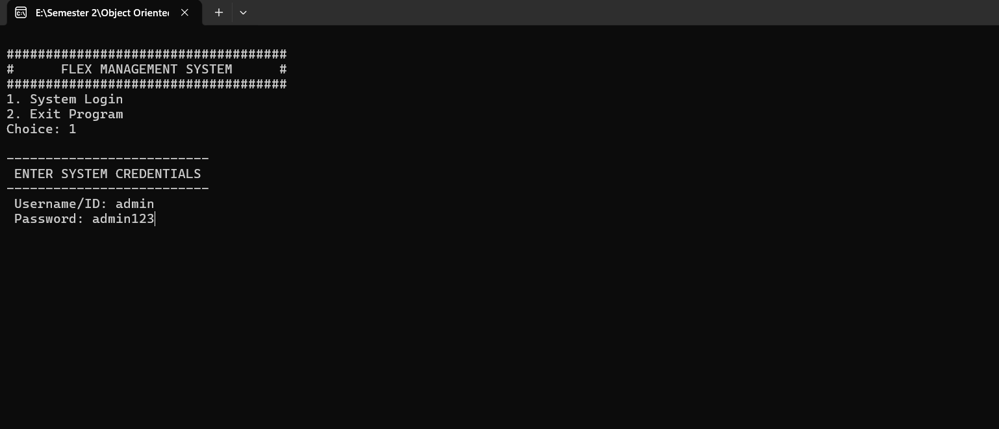
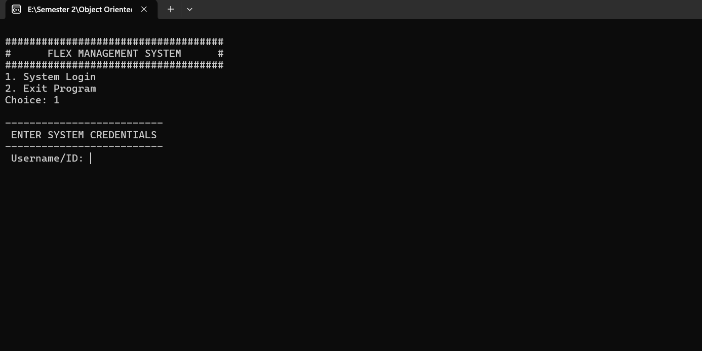
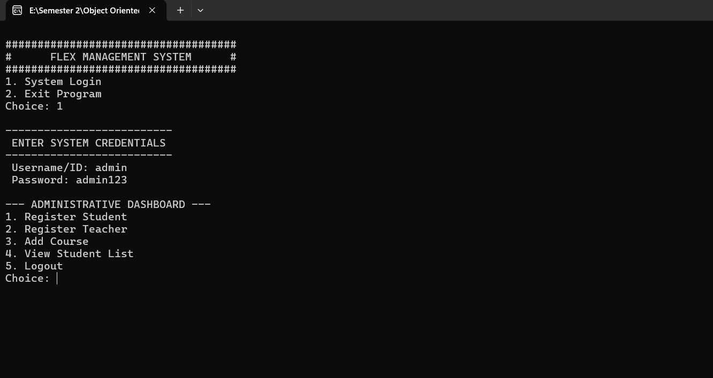
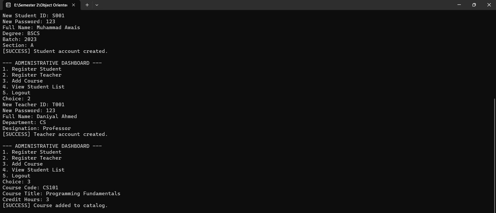
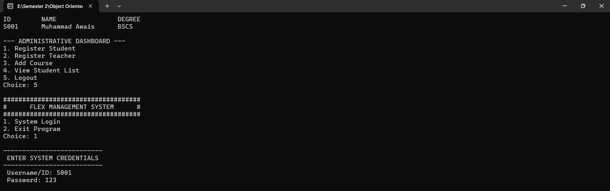
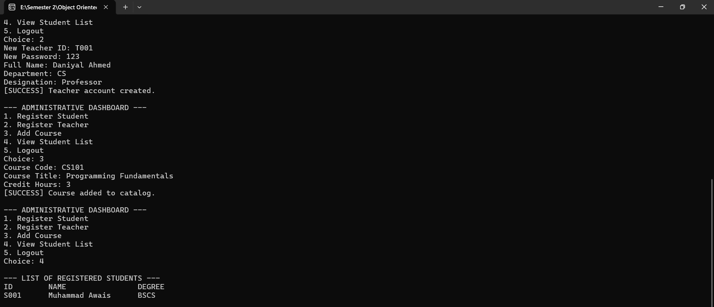
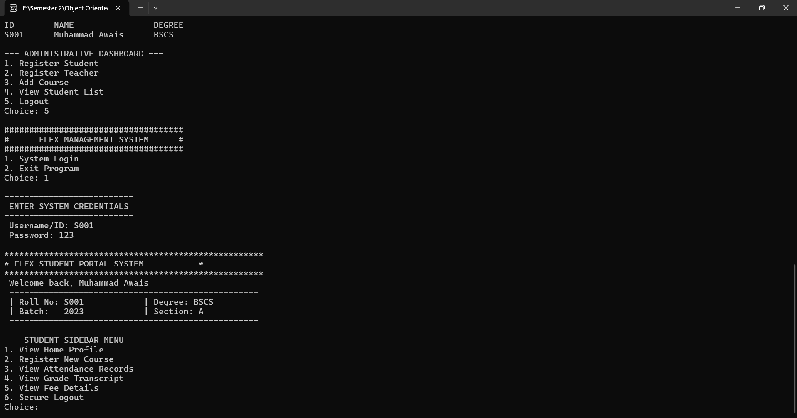
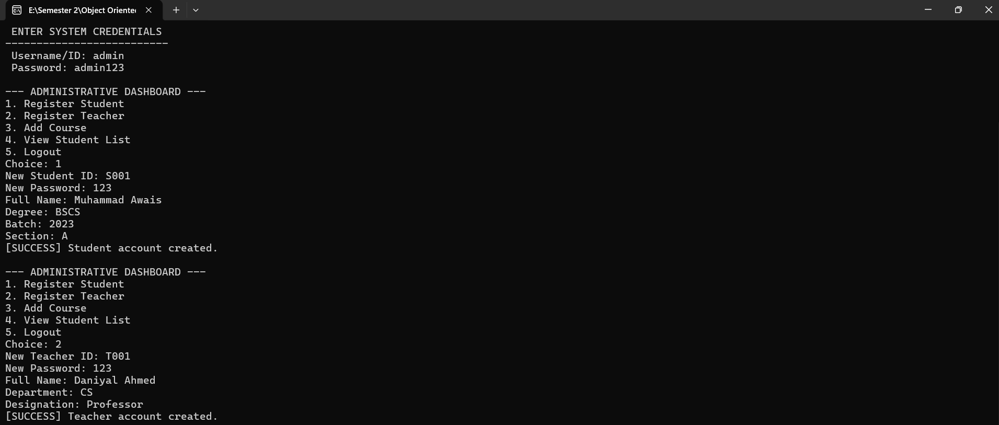
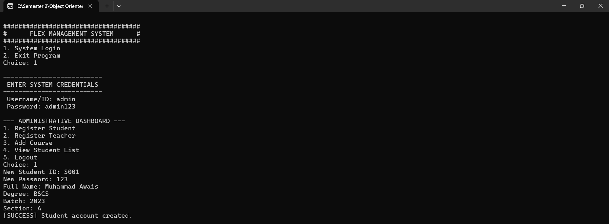

# 🎓 FLEX Management System

<p align="center">
  
  
  
  
</p>

---

## 📌 Overview

FLEX Management System is a **console-based Student Management System** developed in **C++ using Object-Oriented Programming**.

This system manages **students, teachers, courses, attendance, marks, and fees** using **file handling (.txt files)** as a simple database.

---

## 🚀 Features

### 🔐 Login System
- Admin Login
- Secure credential check

---

### 👨‍💼 Admin Functionalities
- Add Students
- Add Teachers
- Add Courses
- Manage Registrations
- Manage Attendance
- Manage Marks
- Manage Fees

---

### 📂 Data Storage
All data is stored using text files:
- `students.txt`
- `teachers.txt`
- `courses.txt`
- `attendance.txt`
- `marks.txt`
- `fees.txt`
- `registrations.txt`

---

## 🛠️ Technologies Used

```diff
+ C++
+ Object-Oriented Programming (OOP)
+ File Handling (Text Files)
+ Console-Based Interface
```

---

## 📂 Project Structure

```
FLEX-Management-System/
│── main.cpp
│── students.txt
│── teachers.txt
│── courses.txt
│── attendance.txt
│── marks.txt
│── fees.txt
│── registrations.txt
│── Screenshots/
│── README.md
```

---

## ▶️ How to Run

1. Open the project in any C++ IDE (VS Code / Dev-C++)
2. Compile `main.cpp`
3. Run the program

---

### 🔑 Admin Login Credentials

```
Username: admin
Password: admin123
```

---

## 📸 Screenshots

### 🔑 Login Screen


---

### 🏠 Main Menu


---

### 👨‍💼 Admin Dashboard


---

### ➕ Course Adding


---

### 🎓 Student Portal


---

### 📋 Student List


---

### 🧑‍🎓 Student Menu


---

### 👨‍🏫 Teacher Entry


---

### 🏫 School Data Entry


---

## 🔮 Future Improvements
- GUI Version (Qt / Web)
- Database Integration (MySQL)
- Multi-user Authentication

---

## 👨‍💻 Author

Vainkut Kumar

Developed as an **OOP Final Project**.

---

## ⭐ Support
If you like this project, give it a ⭐ on GitHub!
